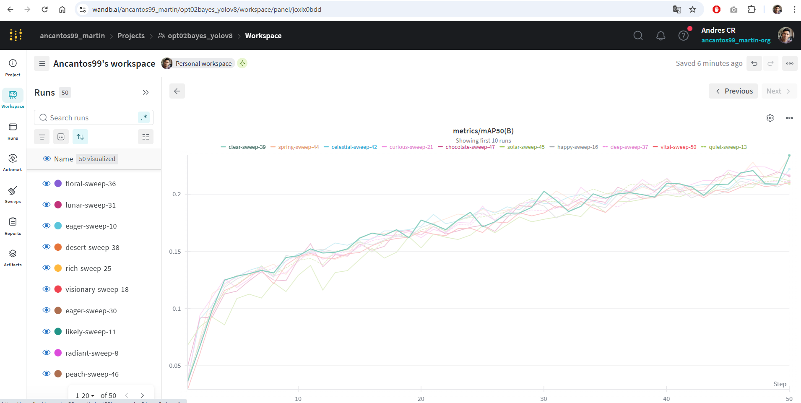
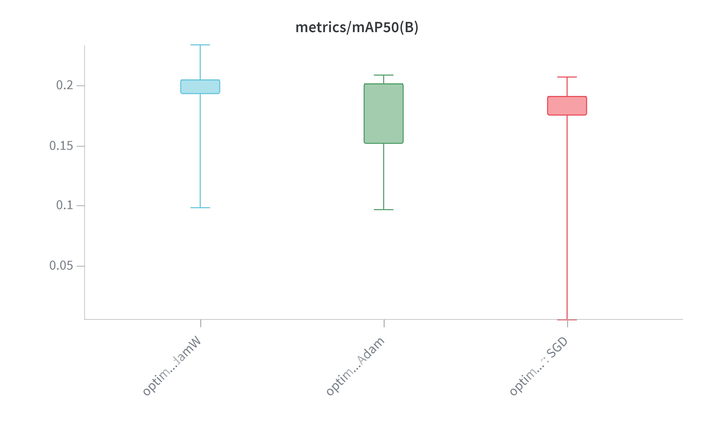
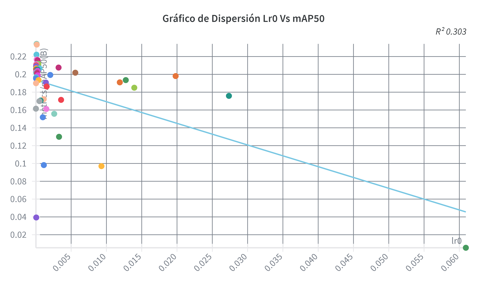
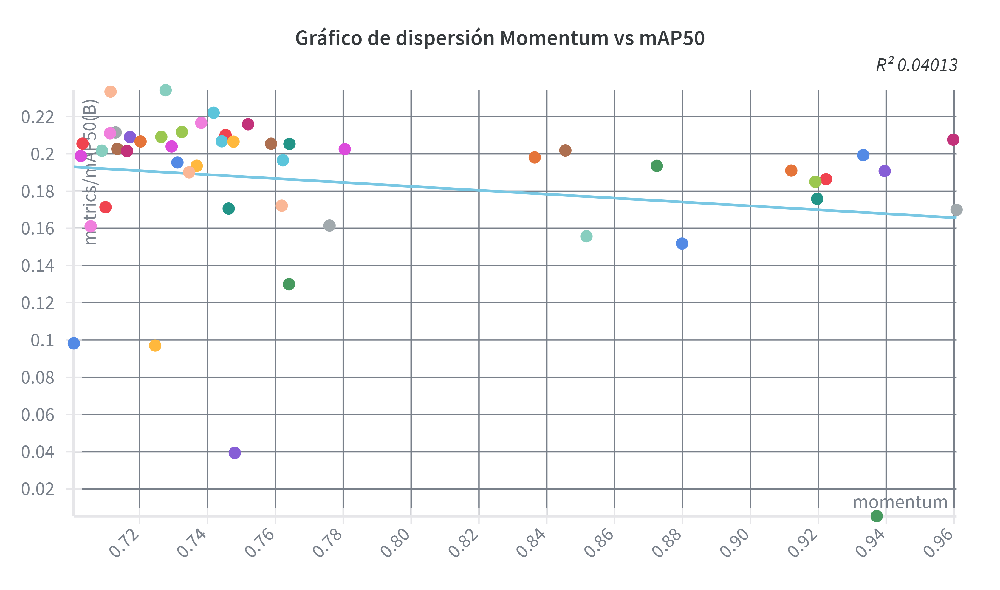
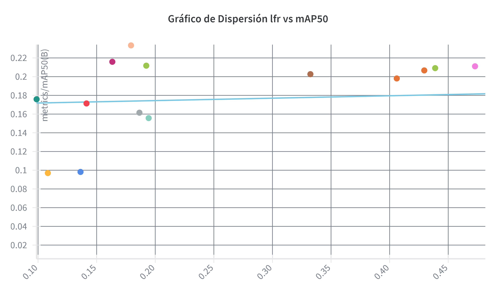
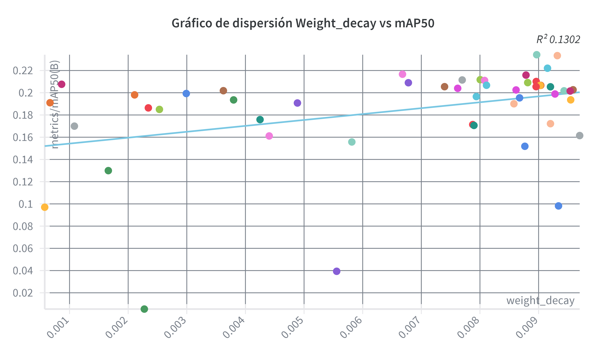
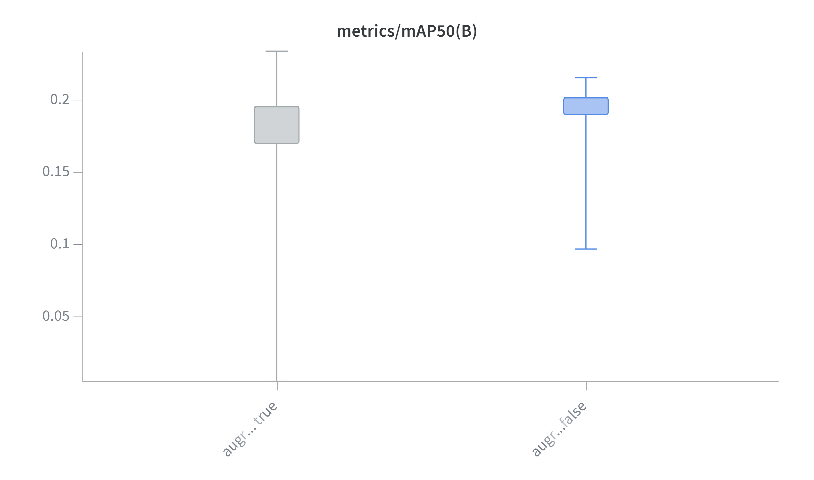
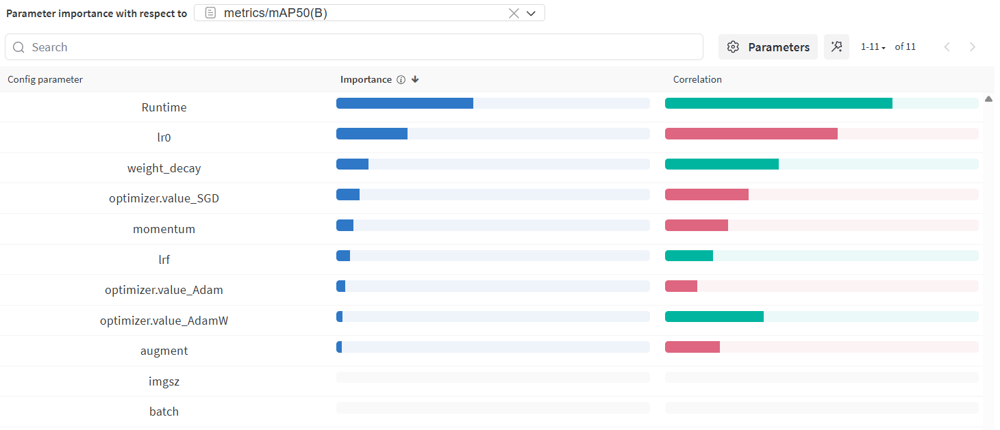
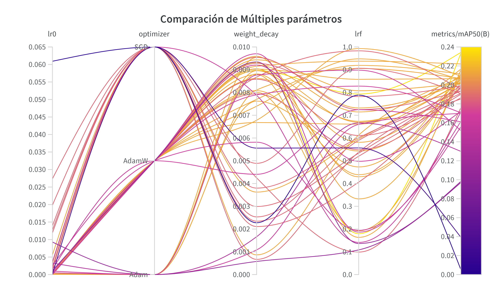

# Optimización de Hiperparámetros para YOLOV8 con Weights & Biases 
> Optimización de Hiperparámetros para YOLOv8 con Optimización Bayesiana y usando la plataforma Weights & Biases 
## ⚙️ Proceso
Cuando se aborda la detección de objetos, la eficiencia del modelo es primordial. Esto nos obliga a afinar la configuración mediante la selección precisa de hiperparámetros. En este artículo, detallo cómo se logró maximizar el desempeño de YOLOv8 **utilizando la plataforma Weights & Biases (W&B).**
- Se utilizó la Aplicación Weights & Biases (W&B), todos los gráficos han sido generados desde su aplicación web
- Se utilizó Optimización Bayesiana
- Se busca Maximizar mAP50
- Se probaron 50 combinaciones
- Para todas las pruebas se utilizó el modelo yolov8l.pt (Versión Large 43.7 M de parámetros)
- Idea general: Hacer un sweep rápido a baja resolución y batch grande (640 y 16 fijos) para encuentrar buenas combinaciones de hiperparámetros rápido. Esto te ahorra muchísimo tiempo y GPU.
- Luego transferir y afinar esas configuraciones en el entrenamiento final a alta resolución y batch ( (1920,1080) y 2 ) ya que usar la resolución original de la imágen ha dado buenos resultados.
### ¿Por qué Optimización Bayesiana?
Optimización Bayesiana (BO) es un enfoque inteligente para buscar hiperparámetros cuando:
- El espacio de hiperparámetros es grande o costoso de evaluar.
- Cada entrenamiento tarda mucho (como en YOLOv8).
### ¿Por qué Maximizar mAP50?
mAP50 significa Precisión Media Promedio con un IoU de 0.5. En términos simples, evalúa cuán bien las cajas delimitadoras predichas por nuestro modelo se superponen con las cajas delimitadoras reales. Maximizar mAP50 significa que nuestro modelo no solo está detectando objetos, sino que también está ubicándolos con precisión.
¿Por qué elegí maximizar mAP50 sobre mAP50-95? Al entrenar nuestro modelo por primera vez con hiperparámetros predeterminados, observamos que mAP50 alcanzó su valor óptimo alrededor de la marca de 50 épocas, mientras que mAP50-95 tomó más tiempo, estabilizándose pasada las 70 épocas
## ✍️ Hiperparámetros explorados y rangos
El modelo YOLOv8 (You Only Look Once) es ampliamente utilizado en tareas de detección de objetos debido a su alta eficiencia. Su rendimiento depende de varios hiperparámetros. En este análisis se considerarán 8 de ellos, de los cuales dos (imgsz y batch) ya se conocen sus valores óptimos para obtener un mejor desempeño. Además, se evita modificar estos parámetros porque hacerlo incrementa significativamente el costo computacional y el tiempo de entrenamiento.
| # | Hiperparámetro | Descripción | Rango |
| :--- | :--- | :--- | :--- |
| **1** | **imgsz** |Tamaño de imagen: Afecta la resolución de las imágenes introducidas en el modelo.  | para la optimización de hiperparámetros se redimensionará a 640. Pero hemos descubierto que los mejores resultados se obtienen con el tamaño original de la imágen (1920,1080) aunque usar esta resolución consume más recursos computacionales y eleva el tiempo de entrenamiento |
| **2** | **batch** | Tamaño del lote: Determina la cantidad de muestras procesadas antes de que el modelo actualice sus pesos | ara la optimización de hiperparámetros se utilizará un lote de 16 ya que al redimensionar la imágen con 640 no cosume mucha vram, pero cuando se utiliza (1920,1080) hay que utilizar un batch de 1 o max 2 ya que puede llegar a consumar hasta 30Gb de Vram  |
| **3** | **optimizer** | Es el algoritmo encargado de actualizar los pesos del modelo durante el entrenamiento para que la red aprenda a detectar objetos correctamente. | 'SGD', 'Adam', 'AdamW' |
| **4** | **momentum** | es un parámetro del optimizador (Solo se usa cuando se prueba con SGD) que acelera el aprendizaje y suaviza las actualizaciones de los pesos del modelo durante el entrenamiento | {'min': 0.7, 'max': 0.97} |
| **5** | **augment** | Indica si introducir o no cambios aleatorios en los datos de entrada aumenta la robustez del modelo | [True, False] |
| **6** | **lr0** | Tasa de aprendizaje: Controla cuánto ajustar el modelo en respuesta al error estimado cada vez que se actualizan los pesos del modelo | "min": 1e-5, "max": 1e-1 |
| **7** | **lrf** | lrf define la tasa de aprendizaje final al final del entrenamiento (en la última época). YOLOv8 ajusta la tasa de aprendizaje de forma exponencial o cosenoidal desde el valor inicial (lr0) hasta lr0 * lrf. | "min": 0.01, "max": 1.0 |
| **8** | **weight_decay** | Factor de regularización L2 para evitar el sobreajuste. Los valores más grandes imponen una regularización más fuerte | 'min': 0.0001, 'max': 0.01 |

## ▶️ Configuración y Redimiento Inicial

<table style="width: 100%;">
<tr>
  <td style="width: 33%; vertical-align: top;"><h4 align="center">Hiperparámetros Iniciales</h4></td>
  <td style="width: 33%; vertical-align: top;"><h4 align="center">Métricas de Rendimiento Inicial General</h4></td>
  <td style="width: 33%; vertical-align: top;"><h4 align="center">Métricas de Rendimiento Inicial Por Clase</h4></td>
</tr>
<tr>
  <td style="width: 33%; vertical-align: top;">   
    <ul>
      <li><b>epochs</b>: 100</li>
      <li><b>imgsz</b> : (1920,1080)</li>
      <li><b>batch</b> : 1</li>
      <li><b>optimizer</b> : Adam</li>
      <li><b>lr0</b> : 0.001</li>
      <li><b>lrf</b> : 0.01</li>
      <li><b>patience</b> : 15</li>
    </ul>
  </td>
  <td style="width: 33%; vertical-align: top;">
    <ul>
      <li><b>Precision</b> :  0.4764</li>
      <li><b>Recall</b> : 0.1636  </li>
      <li><b>F1-score</b> : 0.2436 </li>
      <li><b>mAP@50</b> : 0.159</li>   
    </ul>
  </td>
  <td style="width: 33%; vertical-align: top;">
    <table>
      <tr><th>Clase</th><th>Precision</th><th>Recall</th><th>F1-score</th><th>mAP@50</th></tr>
      <tr><th>0-link</th><td>0.468352</td><td>0.375569</td><td>0.41686</td><td>0.332972</td></tr>
      <tr><th>1-button</th><td>0.457078</td><td>0.444254</td><td>0.450574</td><td>0.394805</td></tr>
      <tr><th>2-input</th><td>0.718178</td><td>0.388889</td><td>0.504561</td><td>0.454618</td></tr>
    </table>
  </td>
</tr>
</table>

## 📋 Exploración Sistemática

Para la exploración de hiperparámetros, se utilizó la **aplicación Weights & Biases (W&B)**, una plataforma especializada en la gestión y seguimiento de experimentos de machine learning.
Se ejecutaron **50 corridas experimentales empleando el método de Optimización Bayesiana, con el objetivo de maximizar la métrica mAP50(B)**, correspondiente al desempeño del modelo YOLOv8 en la detección de objetos.

Todas las gráficas de dispersión, correlación e importancia de parámetros fueron generadas directamente desde la interfaz web de W&B, la cual permite visualizar de manera interactiva la relación entre los hiperparámetros evaluados y la métrica de rendimiento.

se muestra el gráfico con las 10 mejores corridas, correspondientes a las configuraciones con mayor valor de mAP50(B) alcanzadas durante el proceso de optimización. Siendo la mejor el Run39 (clear-sweep-39) con un valor de 0.23422

### Dependencia parcial

<table style="width: 100%; text-align: left; vertical-align: top;">
  <tr>
    <td style="width: 50%; vertical-align: top;" valign="top">
      <h4>Hiperparámetro 1: Optimizer</h4>
      
      
      <b>a) Patrón observado: </b>
      <ul>
        <li>AdamW tiene el mejor desempeño promedio (mayor mAP50 y menor variabilidad).</li>
        <li>Adam es similar, pero con más dispersión.</li>
        <li>SGD tiene el rendimiento más bajo.</li>        
      </ul>
      <b>b) Comparación con configuración actual: </b>
      
Estoy usando Adam, Cambiar de Adam a AdamW mejoraría el mAP50.

      <b>c) Sensibilidad: </b>
      
🔴 CRÍTICO → El optimizador influye fuertemente en el rendimiento.

      
    </td>
    <td style="width: 50%; vertical-align: top;" valign="top">
      <h4>Hiperparámetro 2: Lr0 (Tasa de aprendizaje inicial)</h4>
      
      
      <b>a) Patrón observado: </b>
      <ul>
        <li>Relación negativa fuerte: a mayor lr0, menor mAP50.</li>
        <li>El mejor desempeño está en valores bajos (~0.001–0.005).</li>
        <li>R² ≈ 0.30 indica una correlación clara.</li>        
      </ul>
      <b>b) Comparación con configuración actual: </b>
      
Usamos un lr0 bajo (0.001), estamos en la zona óptima, pero se puede mejorar usando valores menores (~0.00010)

      <b>c) Sensibilidad: </b>
      
🔴 CRÍTICO → Cambios pequeños pueden alterar fuertemente el rendimiento.

      
    </td>  
  </tr>
  <tr>
    <td style="width: 50%; vertical-align: top;" valign="top">
      <h4>Hiperparámetro 3: Momentum</h4>
      
      
      <b>a) Patrón observado: </b>
      <ul>
        <li>No hay una relación lineal clara, pero valores intermedios (~0.72–0.78) parecen concentrar mAP50 más altos.</li>
        <li>A valores altos (> 0.86 ) el rendimiento tiende a bajar, pero no es una tendencia marcada</li>
      </ul>
      <b>b) Comparación con configuración actual: </b>
      
Inicialmente no se usaba, este parámetro se utiliza cuando el Optimizador es SVG. si se elige SVG usar un valor bajo (≈0.72-0.78)

      <b>c) Sensibilidad: </b>
      
🟡 MODERADO → Tiene efecto, pero no cambia drásticamente el resultado.

      
    </td>
    <td style="width: 50%; vertical-align: top;" valign="top">
      <h4>Hiperparámetro 4: Lrf (learning rate final ratio)</h4>
      
      
      <b>a) Patrón observado: </b>
      <ul>
        <li>Correlación muy débil (R² ≈ 0.02), sin patrón claro.</li>
        <li>Los puntos están dispersos sin tendencia definida.</li>
      </ul>
      <b>b) Comparación con configuración actual: </b>
      
Cualquier valor dentro del rango usado funcionaría similar; no se observa ventaja clara.

      <b>c) Sensibilidad: </b>
      
🟡 MODERADO → Tiene poca o nula influencia sobre el resultado.

      
    </td>   
  </tr>
  <tr>
    <td style="width: 50%; vertical-align: top;" valign="top">
      <h4>Hiperparámetro 5: Weight Decay</h4>
      
      
      <b>a) Patrón observado: </b>
      <ul>
        <li>Tendencia ligeramente positiva: mAP50 mejora conforme aumenta weight_decay</li>
        <li>No es lineal fuerte, pero se observa una correlación débil (R² ≈ 0.13).</li>
      </ul>
      <b>b) Comparación con configuración actual: </b>
      
No se utiliza, pero se podría utilizar con valores entre (≈0.007–0.009).

      <b>c) Sensibilidad: </b>
      
🟡 MODERADO → Tiene efecto, pero no cambia drásticamente el resultado.

      
    </td>
    <td style="width: 50%; vertical-align: top;" valign="top">
      <h4>Hiperparámetro 6: Augment (Aumento de datos)</h4>
      
      
      <b>a) Patrón observado: </b>
      <ul>
        <li>Las corridas con augment=True muestran ligeramente mayor mAP50 y menor dispersión que augment=False.</li>
        <li>Ambos obtuvieron un mAP50(B) muy similar</li>
      </ul>
      <b>b) Comparación con configuración actual: </b>
      
Se utiliza pero con transformaciones muy leves, sin alterar la geometría solo brillo, saturación, etc. Y no tiene un incremento significativo en la mejora de la métrica 

      <b>c) Sensibilidad: </b>
      
🟢 BAJA → Afecta el rendimiento, pero no de forma dramática. (El aumento ayuda, pero no es el único factor determinante.)

      
    </td>   
  </tr>
</table>

### Importancia de hiperparámetros

Estos resultados provienen del panel de Importancia de Parámetros (Parameter Importance) de Weights & Biases (W&B), generado después de ejecutar una búsqueda de hiperparámetros (Sweep) para un modelo de detección de objetos (probablemente YOLOv8).

El gráfico tiene como objetivo mostrar cuáles de los hiperparámetros que probaste tuvieron el mayor impacto en la métrica objetivo, que en este caso es el metrics/mAP50 (Mean Average Precision al umbral de IoU 0.50).

- **Columna Importancia:** Cuanto más larga sea la barra azul, más influyente fue ese parámetro en el resultado final del rendimiento (mAP50).
- **Columna Correlation:** Esta columna visualiza la relación direccional (positiva o negativa) entre el parámetro y la métrica mAP50.
  - Barra Verde (Positiva 🟢): A medida que el valor del parámetro aumenta, el mAP50 tiende a aumentar (relación directa).
  - Barra Roja (Negativa 🔴): A medida que el valor del parámetro aumenta, el mAP50 tiende a disminuir (relación inversa).

## Conclusiones del gráfico Importancia de los parámetros respecto a mAP50

1. **Runtime:** Es el parámetro más influyente en el gráfico. Puede indicar que el tiempo de ejecución (o la cantidad de épocas/pasos realizados) es el factor dominante, o que W&B usó esta variable proxy para medir el impacto de la duración del entrenamiento.
2. **Enfocarse en la Tasa de Aprendizaje (lr0):** Dado que es el hiperparámetro con mayor impacto (y tiene una fuerte correlación negativa), debes priorizar probar valores más pequeños de lr0 en futuras búsquedas.
3. **Regularización (weight_decay):** Este parámetro también es importante. Su correlación positiva sugiere que podrías probar valores ligeramente más altos para mejorar el rendimiento.
4. **Optimizador:** La correlación negativa de optimizer: SGD y la positiva de optimizer:value_AdamW (aunque con baja importancia) sugieren que AdamW podría ser una mejor opción inicial que SGD para tu modelo y conjunto de datos.
5. **lrf:** La correlación negativa de optimizer: SGD y la positiva de optimizer:value_AdamW (aunque con baja importancia) sugieren que AdamW podría ser una mejor opción inicial que SGD para tu modelo y conjunto de datos.
6. **Parámetros Menos Importantes:** se puede gastar menos tiempo en ajustar parámetros con baja importancia (como momentum o augment), ya que cambiarlos probablemente no generará una mejora dramática en el rendimiento. El parámetro momentum solo tiene sentido usarlo si se utiliza el Optimizador SGD
7. **imgsz o lrf:** en el entrenamiento final utilizar el tamaño real de la imágen que ha dado buenos resultados Pero incrementa la cantidad de 

#### Tabla de Importancia
| Ranking | Hiperparámetro | Importancia(%) | Clasificación | Acción Recomendada |
| :--- | :--- | :--- | :--- |:--- |
|1| lr0 (tasa de aprendizaje inicial) | 30% | 🔴 Crítico | Ajustar cuidadosamente; mantener en rango 1e-4 a 1e-2. Valores muy altos reducen el mAP50.|
|2| optimizer  | 26% | 🔴 Crítico |  SVG dió un rendimiento inferior comparado a los otros 2, AdamW y Adam muestran rendimientos similares; puede elegirse por eficiencia AdamW |
|3| weight_decay (regularización L2)  | 20% | 🟡 Importante / Moderado | Afinar entre 0.006 y 0.009. Ayuda a evitar sobreajuste y mejora ligeramente la métrica mAP50. |
|4| momentum   | 18% | 🟡 Importante / Moderado (Si se usa SVG) | Mantener valores intermedios (~0.85). Influye en la estabilidad del entrenamiento (Si se usa SVG) |
|5| lrf (factor de decaimiento del learning rate) | 11% | 🟡 Moderado | Ajustar levemente para refinar la convergencia al final del entrenamiento |
|6| augment (aumento de datos) | 7% | 🟢 Bajo |

### Análisis de Interacciones

El gráfico proporcionado es un gráfico de coordenadas paralelas que muestra la interacción de múltiples hiperparámetros (lr0, optimizer, weight_decay, lrf) con respecto al score (mAP50(B)). La intensidad del color (de morado/gris a amarillo/naranja) indica la magnitud del score, siendo el amarillo/naranja el score más alto (zona "caliente").

#### **1.- Interacción entre lr0 y optimizer**

**a) Tipo de interacción**

- La interacción observada es Condicional: El efecto del valor de lr0 (tasa de aprendizaje inicial) depende fuertemente del optimizer seleccionado. Por ejemplo, el Adam y AdamW alcanzan los mejores scores (líneas naranjas/amarillas) con valores de $lr0$ cercanos a cero o muy bajos, mientras que el SGD alcanza los mejores scores con valores de $lr0$ mucho más altos (alrededor de $0.050$ a $0.065$).

**b) Descripción del patrón**

En el gráfico, se observa que los mejores resultados (líneas naranjas/amarillas) están claramente separados por el optimizador:
- Para Adam y AdamW, la zona "caliente" se concentra en los valores más bajos de lr0 (cercanos a 0.000 e inferiores a 0.035).
- Para SGD, la zona "caliente" se concentra en los valores más altos de lr0

**c) Mejor combinación identificada (lr0 y optimizer)**

lro: 0.00010461569036727104
Optimizer: AdamW
Score: mAP50(B)  0.23422

**d) Implicación práctica**

Este hallazgo significa que la elección del optimizador dicta completamente el rango óptimo para la tasa de aprendizaje inicial ($lr0$). Para optimizar el proyecto, es crucial sintonizar $lr0$ a valores altos si se usa SGD, pero a valores bajos si se usa Adam o AdamW. No se puede buscar un único valor de $lr0$ sin considerar el optimizador.

#### **2.- Interacción entre weight_decay y lrf**

Cómo se va a utilizar AdamW, se obvió analizar el hiperparámetro momentum ya que este hiperparámetro solo funciona con SGD

**a) Tipo de interacción**

- La interacción observada parece ser Independiente a primera vista, tendiendo a Antagónica en casos extremos.

- La mayoría de las líneas que logran un alto score (amarillo/naranja) no tienen un patrón de cruce muy específico entre estas dos variables, sugiriendo un efecto aditivo (Independiente). No obstante, los valores muy altos de weight_decay (cercanos a $0.010$) parecen no combinarse bien con valores de $lrf$ en el rango medio ($0.5$ a $0.7$), sugiriendo una ligera tendencia Antagónica donde un valor extremo de uno parece contrarrestar el efecto positivo del otro, aunque la tendencia principal es más hacia un efecto aditivo general.

**b) Descripción del patrón**

En el gráfico, se observa que La zona "caliente" (líneas amarillo/naranja) abarca un rango amplio:
- Para weight\decay$ los mejores resultados están bien distribuidos, sin una concentración clara, aunque muchos de los mejores scores provienen de valores alrededor de 0.005 a 0.009
- Para lrf, hay una ligera concentración de buenos scores en los valores altos (cercanos a 1.0), pero también hay líneas de alto score que cruzan cerca de 0.0. La mejor combinación está distribuida en el espacio de estos dos hiperparámetros.

**c) Mejor combinación identificada (lr0 y optimizer)**

weight_decay: 0.00896772765532472
lrf: 0.7931465265044085
Score: mAP50(B)  0.23422

**d) Implicación práctica**

Este hallazgo sugiere que, mientras otros hiperparámetros se optimizan, weight_decay y lrf ofrecen cierta flexibilidad sin comprometer drásticamente el rendimiento, especialmente si se mantienen en los extremos (bajo weight_decay y alto lrf). Se puede priorizar la sintonización de lr0 y optimizer, y luego refinar estos dos hiperparámetros, manteniendo a menudo weight_decay bajo para minimizar la regularización y lrf alto para mantener una tasa de aprendizaje final alta.

## 📋 Interpretación y Conclusiones

Los tres hiperparámetros más importantes para el modelo YOLOv8 son:
1. **Tasa de aprendizaje inicial (lr0): ** que mostró la mayor sensibilidad: valores demasiado altos degradan el mAP50, mientras que un rango medio-bajo (~0.005) logra un equilibrio entre velocidad y estabilidad.
2. **Optimizer: ** tiene un papel crucial en la dinámica de ajuste de los pesos. Determina cómo se aplican los gradientes y, por tanto, cómo evoluciona el aprendizaje. 
3. **Weight decay: ** que actúa como regularizador, ayuda a mejorar el rendimiento evitando el sobreajuste, especialmente en datasets pequeños o con ruido.

Adicionalmente, el parámetro Momentum puede considerarse importante en configuraciones que usan SGD, ya que suaviza las actualizaciones de los pesos y mejora la convergencia; sin embargo, no aplica directamente en nuestro caso.

Estos tres parámetros son claves para el control del aprendizaje y la estabilidad del entrenamiento.

En cambio, parámetros como lrf y augment mostraron variaciones menores en el rendimiento, por lo que en futuras optimizaciones pueden mantenerse fijos dentro de rangos razonables sin afectar significativamente el desempeño.

## ✅ Rendimiento con configuración óptima

Para el proceso de optimización de hiperparámetros del modelo YOLOv8, se realizaron inicialmente 50 corridas empleando una resolución de imagen de 640 píxeles y un tamaño de lote (batch size) de 16, con el objetivo de acelerar el entrenamiento y facilitar el análisis de los hiperparámetros learning rate (lro), learning rate factor (lfr), weight decay y optimizer mediante optimización bayesiana. Posteriormente, se llevaron a cabo 8 corridas adicionales utilizando una resolución de (1920, 1080) y un batch size de 6, que corresponden a los valores reales planificados para el entrenamiento final del modelo, con el fin de ajustar y afinar los hiperparámetros seleccionados en condiciones más cercanas al escenario definitivo de entrenamiento.

a continuación se muestra los hiperparámetros finales utilizados y los resultados obtenidos:

<table style="width: 100%;">
<tr>
  <td style="width: 33%; vertical-align: top;"><h4 align="center">Hiperparámetros Iniciales</h4></td>
  <td style="width: 33%; vertical-align: top;"><h4 align="center">Métricas de Rendimiento Inicial General</h4></td>
  <td style="width: 33%; vertical-align: top;"><h4 align="center">Métricas de Rendimiento Inicial Por Clase</h4></td>
</tr>
<tr>
  <td style="width: 33%; vertical-align: top;">   
    <ul>
      <li><b>epochs</b>: 100</li>
      <li><b>imgsz</b> : (1920,1080)</li>
      <li><b>batch</b> : 6</li>
      <li><b>optimizer</b> : AdamW</li>
      <li><b>lr0</b> :0.00004694921598565255</li>
      <li><b>lrf</b> : 0.46315</li>
      <li><b>weight_decay</b> : 0.00808107114573286</li>
      <li><b>patience</b> : 15</li>
    </ul>
  </td>
  <td style="width: 33%; vertical-align: top;">
    <ul>
      <li><b>Precision</b> : 0.7616</li>
      <li><b>Recall</b> :   0.2383</li>
      <li><b>F1-score</b> :  0.3630</li>
      <li><b>mAP@50</b> : 0.268</li>   
    </ul>
  </td>
  <td style="width: 33%; vertical-align: top;">
    <table>
      <tr><th>Clase</th><th>Precision</th><th>Recall</th><th>F1-score</th><th>mAP@50</th></tr>
      <tr><th>0-link</th><td>0.788805</td><td>0.507472</td><td>0.61761</td><td>0.581007</td></tr>
      <tr><th>1-button</th><td>0.785473</td><td>0.685185</td><td>0.631176</td><td>0.598784</td></tr>
      <tr><th>2-input</th><td>0.841365</td><td>0.685185</td><td>0.755286</td><td>0.737391</td></tr>
    </table>
  </td>
</tr>
</table>

## ✅ COMPARACIÓN ANTES/DESPUÉS

| Aspecto | Configuración Original | Configuración Optimizada | Cambio | 
| :--- | :--- | :--- | :--- |
| Métrica principal mAP50(B) | 0.1636 | 0.268 | +63.81% |
| Precision | 0.4764 |  0.7616 | +59.86% |
| Recall | 0.1636 |   0.2383 | +45.05% |
| Tiempo de entrenamiento | 8591.96 minutos (100 épocas con early stopping 15: se corrieron 63 épocas)| 6891.00 minutos (100 épocas con early stopping 15: se corrieron 100 épocas) | -19.79% |
| Tamaño del modelo | 83.8 MB | 83.8 MB | 0% |
| Gpu Utilizada | GPU t4 | GPU A100 | N/A |
| Complejidad del modelo |  Alta |  Alta| | N/A |

Los resultados de la optimización son sumamente positivos, ya que se logró una mejora sustancial en todas las métricas de rendimiento del modelo con la misma arquitectura y, lo más notable, con un menor tiempo total de entrenamiento, a pesar de completar un mayor número de épocas.

Este éxito se debe principalmente a dos factores: la optimización de hiperparámetros (que permitió al modelo aprender de manera mucho más efectiva, mejorando significativamente el mAP50(B), la Precisión y el Recall) y el cambio de hardware de una GPU t4 a una A100. La GPU A100 es significativamente más potente y permite reducir el tiempo por época, lo que compensa con creces el mayor número de épocas y resulta en un entrenamiento más rápido y un modelo de mucha mayor calidad.

Dado que el Tamaño del modelo permanece en 83.8 MB para ambas configuraciones, esto implica que no hubo cambios en la arquitectura. Por lo tanto, la complejidad del modelo es la misma en ambos casos. La complejidad se clasifica como Alta porque se está utilizando la arquitectura YOLOv8l ("large"), la cual pertenece al extremo superior de las variantes de la familia YOLOv8.

Lo que si se notó es una ligera penalización en el tiempo de inferencia (latencia), el modelo optimizado tiene un aumento en el tiempo de predicción.

